# What's the next one?

## Overview

"What's the next one?" is an SEO optimized website that allows users to find the next book in a book series.

### Problem Space

People search the internet looking for the next book in a book series, so they can continue reading their favorite series. They want a quick answer, and a good one.
Right now, there isn't there a good website to find the next book in a book series. There a few suboptimal solutions, but none that combine a good user experience with comprehensive series listings database.

#### Competitors

[OrderOfBooks.com](https://www.orderofbooks.com) -> Bad UX, held back, due to the front end being built in wordpress.
[BookSeriesInOrder.com](https://www.bookseriesinorder.com) -> Suffering from same issues as OrderOfBooks.com, due to also being built in wordpress. Though, it is SEO optimized and contains the most complete list of series and books
[GoodReads](https://www.goodreads.com) -> Great UX, but suffers from a lack of comprehensive series listings, the the "series lists" are user compiled.
Google Search Featured Snippet -> Parses data from the first page of Google Results, and bubbles the best result up the to the top. This isn't always easy to read, nor is it comprehensive, sometimes books just have no results.

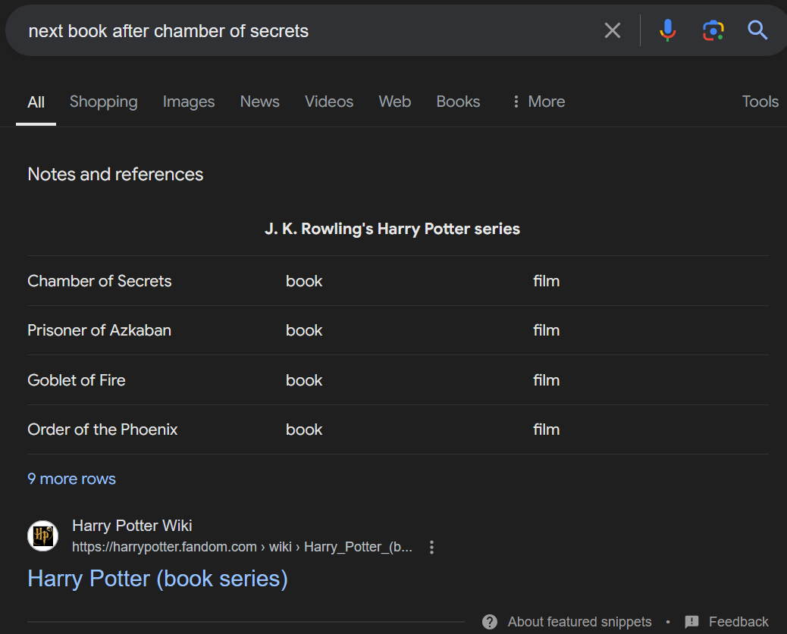
*Example of a Google Search Featured Snippet*

### User Profile

#### Target Demographic

The target demographic for "What's the next one?" includes both males and females aged 18-35 who are avid readers of book series. These users are looking for a quick and easy way to find the next book in their favorite series.

### Features

- As a user, I want to be able to find the next book in a book series so that I can continue reading my favorite series without interruption.
- As a user, I want the website to have an intuitive and user-friendly interface, so that I can quickly locate the next book in a series.
- As a user, I want the website to have a comprehensive database of book series, so that I can find the next book in any series I am interested in.
- As a user, I want the website to have a search bar, so that I can quickly find the next book in a series.
- As I user, I want the search bar to have autocomplete functionality, so that I can quickly find the next book in a series.
- As a user, I want the autocomplete to be powered by fuzzy matching, so that I can find the next book in a series even if I don't know the exact title/series/author.
- As a user, I want the website to be quick, so that I can find the next book in a series without having to wait for the page to load.
- As a user, I want the website to be highly visible in search engine results, ideally appearing as the first or second result, so that I can easily find it when searching for the next book in a series using a search engine.
- As a user, I want the website to also show the book series in order, so that I can see the series as a whole.
- As a user, I want the website to have a "Read More" button, so that I can read more about the book series.
- As a user, I want the website to have a "Buy Now" button, so that I can buy the next book in the series.
- As a user, I want to be able to see all books written by an author, in order, so that I can see all the books by an author.
- As a user, I want a contact form, so that I can contact the website owner with feedback.

## Implementation

### Tech Stack

I have created two plans, Plan A and Plan B. Plan A is the main plan, and Plan B is a backup plan in case Plan A fails to deliver the desired results. Plan B is a mix of alternative technologies that may be easier to implement.

#### Plan A

- Front End: Next.js, TailwindCSS
- Back End: Node.js, Express
- Database: PostgreSQL hosted on Supabase, using GraphQL for querying
- Hosting: Github Pages
- Domain: Whatsthenext.one
- Front End Libraries: Axios, React-router-dom
- Back End Libraries: Express

#### Plan B (Backup)

- Front End: Next.js, MaterialUI
- Back End: Node.js, Express
- Headless CMS: Strapi
- Autocomplete: Algolia
- Hosting: Vercel
- Domain: Whatsthenext.one
- Front End Libraries: Redux, react-router-dom
- Back End Libraries: Express

### APIs

No external APIs will be used, all data will be self-hosted.

### Sitemap

The sitemap will be simple, with no navigation at the top, except for the search bar. The search bar will be used to search for the next book in a series.

**The sitemap will be as follows:**

- Navigation:
  - Home: The home page will contain a search bar (which can be used to search author, book or series), a list of popular series (links to the series page), and a list of popular authors (links to the author page). Users will be able to select from the dropdown menu to search for the next book in a series.
  ~~- Search Results: The search results page will display a list of search results, limited to 10 results at a time. The user can navigate through the results using pagination. Each search result will contain a link to the book, author or series page. **(This page can be replaced with instead allowing the users to select from the search bar dropdown menu instead of navigating to a new page)**~~
- Content:
  - Series: The series page will contain a list of all the books in a series, each with their first book front page/icon, the year they were published, a "Read More" button (links to the book page) and a "Buy Now" button (links to affiliate amazon link).
  - Book: The book page will contain the book's icon/front page (storing this much data may be too much, may need to be sourced, best saved for later development), title, year they were published, author, and a teaser blurb (still to be sourced)
  - Author: The author page will have a link to a short bio, their website and contain a list of all the books (and their title/icon/year they were published) by that author, in order, grouped by series, each with a "Read More" button (links to the book page) and a "Buy Now" button (links to affiliate amazon link), similar to the series page.
- Misc:
  - Contact: The contact page will contain a contact form, allowing users to send feedback to the website owner. (This page may be replaced by a contact form in the footer of the website)

### Authentication

The website will not require authentication, as the point of the website is to provide a resource to the user.

### Mockups

#### Color Palette

Still to be decided, likely to use a default/built-in palette

#### Typography

Still to be decided, should be easy to read, maybe sans-serif?

#### Visual Mockups

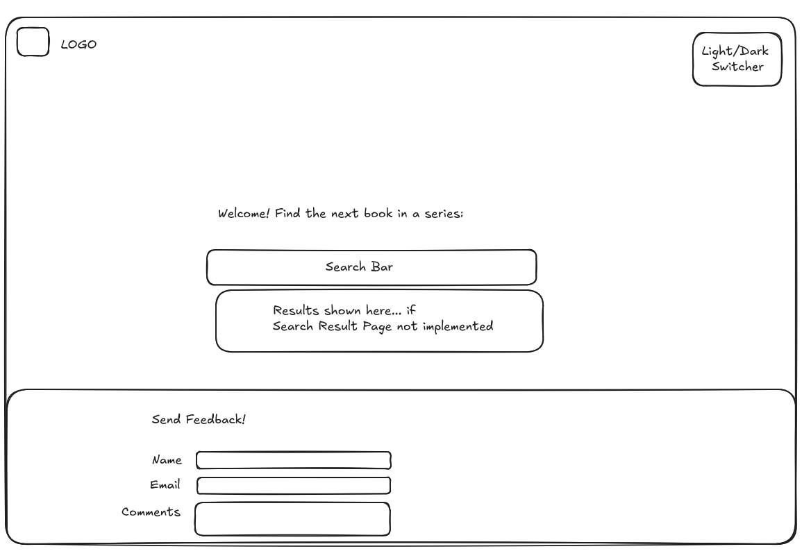
*Mockup 1: Home Page*

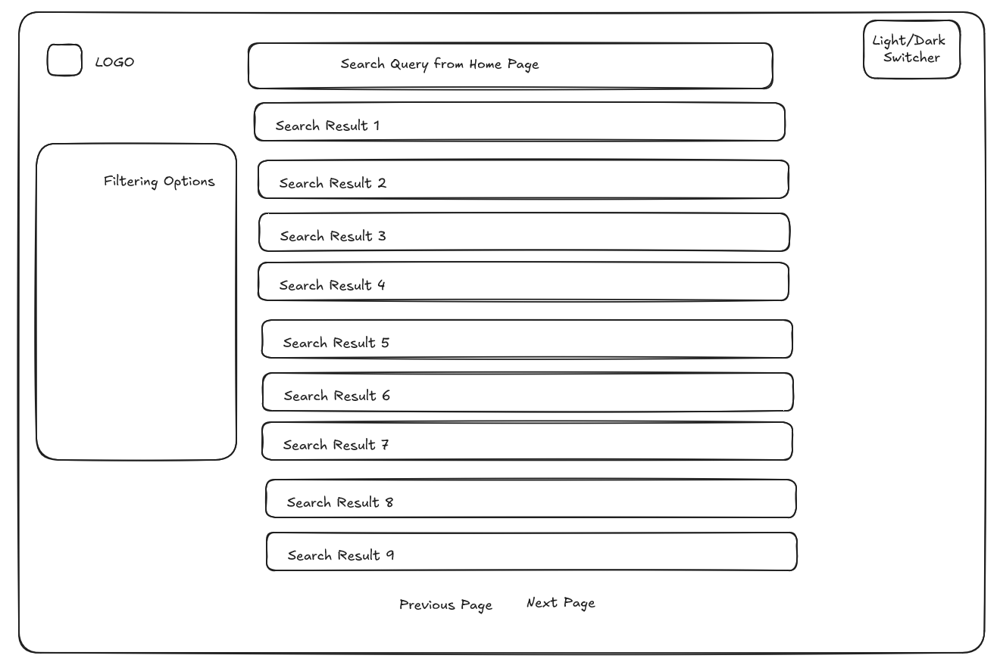
*Mockup 2: Search Results Page*

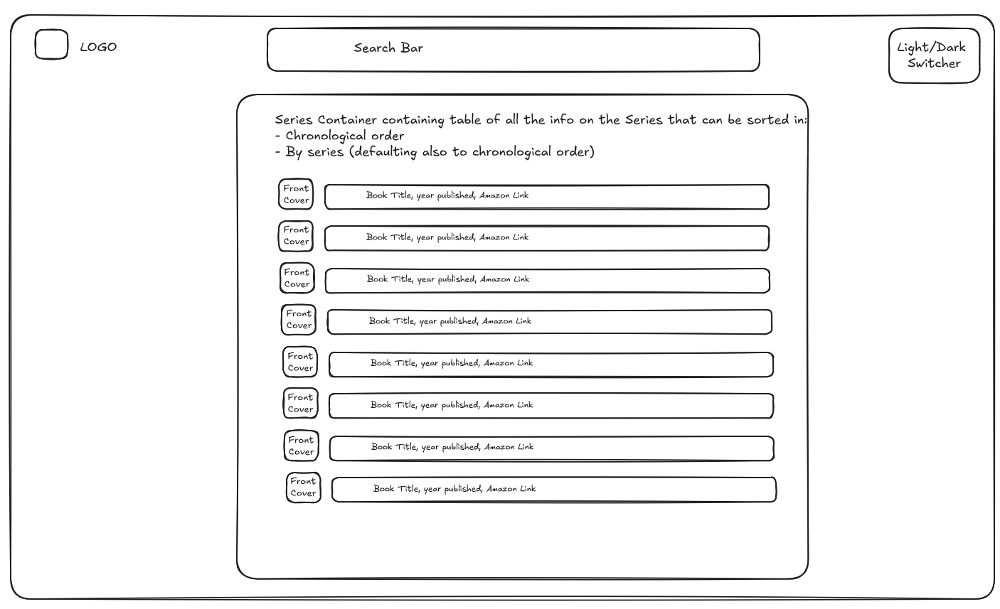
*Mockup 3: Series Page*

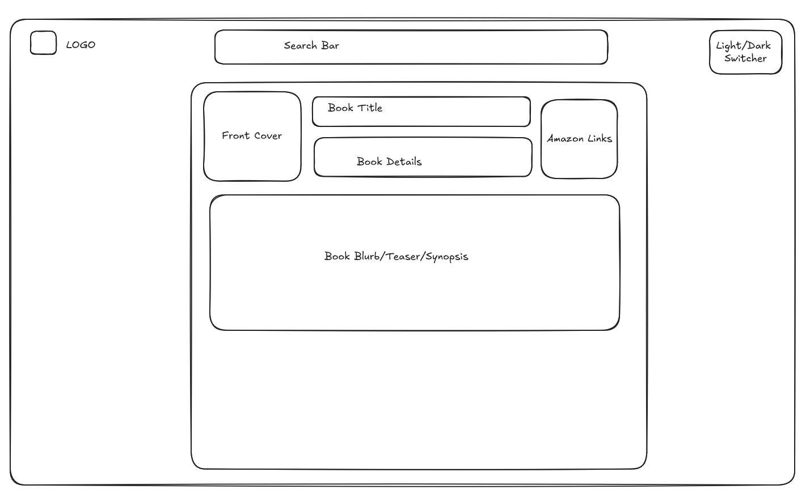
*Mockup 4: Book Page*

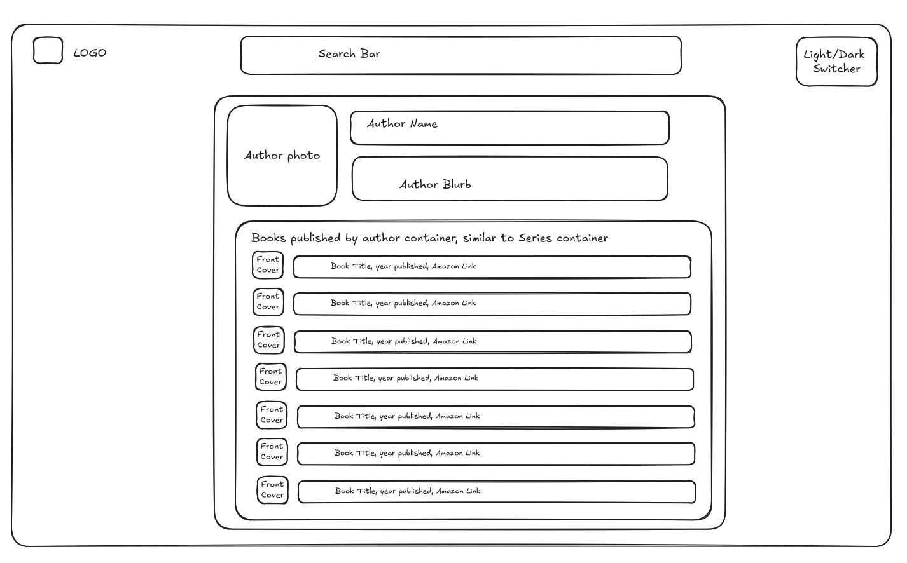
*Mockup 5: Author Page*

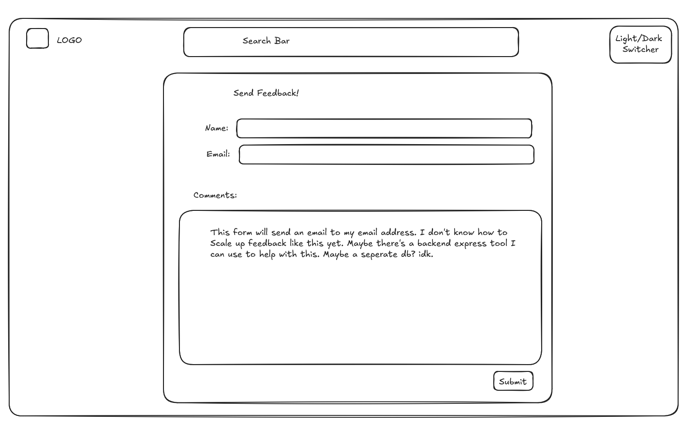
*Mockup 6: Contact Page*

### Data

The data will be stored in a PostgreSQL database, hosted on Supabase (or some other backend provider). Postgres is a relational database, which will allow for easy querying of the data and was chosen for its built-in ability to fuzzy search. The data will be sourced from a variety of different websites, including:

- BookSeriesInOrder
- GoodReads
- Google

The main portion of the data will be scraped from BookSeriesInOrder.com, as it currently has the most comprehensive list of books in series. For the demo, only a small subset of the data is needed, but the plan is to have a comprehensive list of books in the future.

#### Database Schema

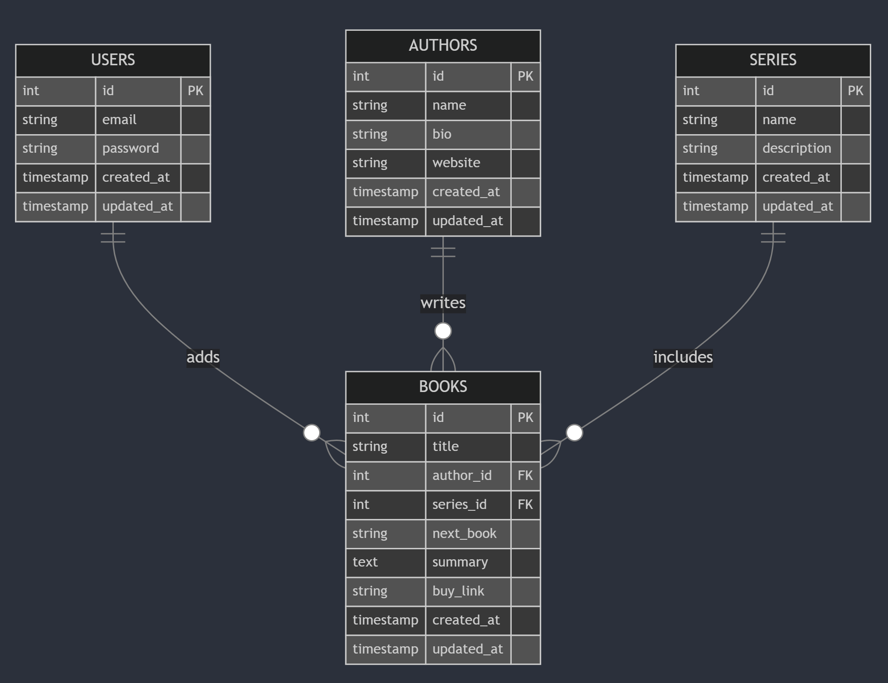
*Diagram 1: Database schema showing relationships between Users, Authors, Books, and Series tables*

#### CRUD Flow

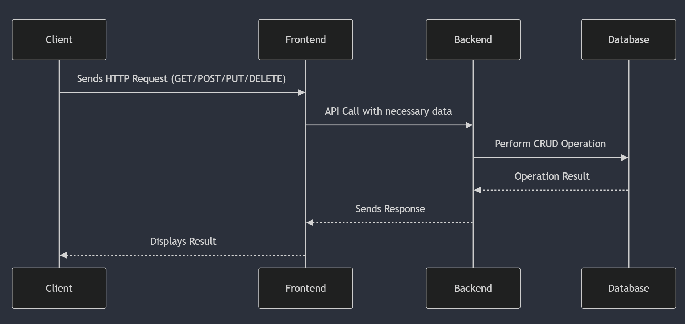
*Diagram 2: CRUD operations flow between Client, Frontend, Backend, and Database*

#### Authentication Flow

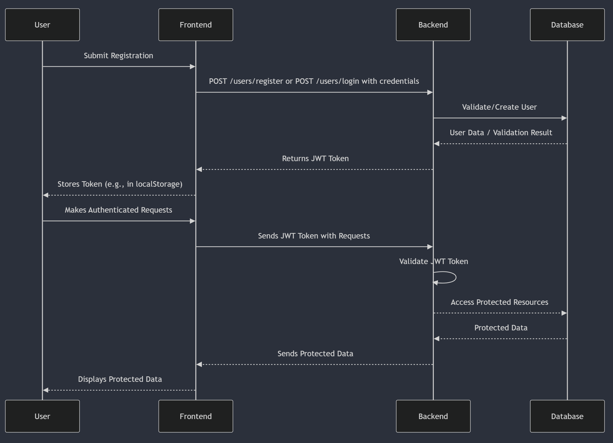
*Diagram 3: User authentication flow using JWT tokens*

#### API Endpoint Flow

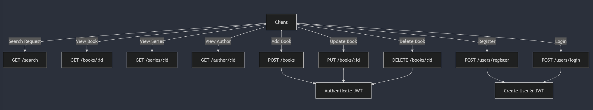
*Diagram 4: Overview of API endpoints and their relationships*

These diagrams provide a visual representation of the database structure, data flow, authentication process, and API endpoints for the "What's the next one?" application, but are not final iterations nor exhaustive.

### Endpoints

#### Front End Endpoints

The frontend will only be used to display the data. Any updating of the data will be done from the CLI or using scripts.

##### GET /search

Description: Search for books, authors, or series based on a query string.

Parameters:

- query: String to search for books, authors, or series.
- limit (optional): Number to limit the number of results.
- offset (optional): Number for pagination.

Response:

```json
    {
        "books": [
            {
                "id": 1,
                "title": "Quantum Adventures",
                "author": "Jane Doe",
                "series": "Quantum Series",
                "next_book": "Quantum Odyssey",
                "summary": "An exciting adventure through quantum realms.",
                "buy_link": "https://amazon.com/quantum-odyssey",
                "created_at": "2023-10-01T12:34:56Z"
            },
            ...
        ],
        "authors": [
            {
                "id": 1,
                "name": "Jane Doe",
                "bio": "An acclaimed author of quantum-themed adventures.",
                "website": "https://janedoe.com"
            },
            ...
        ],
        "series": [
            {
                "id": 1,
                "name": "Quantum Series",
                "description": "A series exploring the realms of quantum physics through fiction.",
                "books": [1, 2, 3]
            },
            ...
        ]
    }
```

##### GET /books/:id

Description: Retrieve details of a specific book by its ID.

Parameters:

- id: Book ID as a number.

Response:

```json
    {
        "id": 1,
        "title": "Quantum Adventures",
        "author": "Jane Doe",
        "series": "Quantum Series",
        "next_book": "Quantum Odyssey",
        "summary": "An exciting adventure through quantum realms.",
        "buy_link": "https://amazon.com/quantum-odyssey",
        "created_at": "2023-10-01T12:34:56Z"
    }
```

##### GET /series/:id

Description: Retrieve all books within a specific series by the series ID.

Parameters:

- id: Series ID as a number.

Response:

```json
    {
        "id": 1,
        "name": "Quantum Series",
        "description": "A series exploring the realms of quantum physics through fiction.",
        "books": [
            {
                "id": 1,
                "title": "Quantum Adventures",
                "author": "Jane Doe",
                "next_book": "Quantum Odyssey",
                "summary": "An exciting adventure through quantum realms.",
                "buy_link": "https://amazon.com/quantum-odyssey",
                "created_at": "2023-10-01T12:34:56Z"
            },
            ...
        ]
    }
```

##### GET /author/:id

Description: Retrieve all books written by a specific author by the author ID.

Parameters:

- id: Series ID as a number.

Response:

```json
    {
        "id": 1,
        "name": "Jane Doe",
        "bio": "An acclaimed author of quantum-themed adventures.",
        "website": "https://janedoe.com",
        "books": [
            {
                "id": 1,
                "title": "Quantum Adventures",
                "series": "Quantum Series",
                "next_book": "Quantum Odyssey",
                "summary": "An exciting adventure through quantum realms.",
                "buy_link": "https://amazon.com/quantum-odyssey",
                "created_at": "2023-10-01T12:34:56Z"
            },
            ...
        ]
    }
```

#### Back End Endpoints

##### POST /books

Description: Add a new book to the database. Authenticated users only.

Parameters:

- title: Book title as a string.
- author: Author name as a string.
- series: Series name as a string.
- next_book: Next book title as a string.
- summary: Book summary as a string.
- buy_link: Affiliate link as a string.
- user_id: ID of the authenticated user adding the book.

Authentication: Requires JWT token

Response:

```json
    {
        "id": 2,
        "title": "Quantum Odyssey",
        "author": "Jane Doe",
        "series": "Quantum Series",
        "next_book": null,
        "summary": "The continuation of quantum adventures.",
        "buy_link": "https://amazon.com/quantum-odyssey",
        "created_at": "2023-10-02T08:20:30Z"
    }
```

##### PUT /books/:id

Description: Update a book in the database. Authenticated users (via CLI only).

Parameters:

- id: Book ID as a number.
- title (optional): Book title as a string.
- author (optional): Author name as a string.
- series (optional): Series name as a string.
- next_book (optional): Next book title as a string.
- summary (optional): Book summary as a string.
- buy_link (optional): Affiliate link as a string.

Authentication: Requires JWT token

Response:

```json
    {
        "id": 2,
        "title": "Quantum Odyssey",
        "author": "Jane Doe",
        "series": "Quantum Series",
        "next_book": null,
        "summary": "The continuation of quantum adventures.",
        "buy_link": "https://amazon.com/quantum-odyssey",
        "created_at": "2023-10-02T08:20:30Z"
    }
```

##### DELETE /books/:id

Description: Delete a book from the database. Authenticated users (via CLI only).

Parameters:

- id: Book ID as a number.

Authentication: Requires JWT token

Response:

```json
    {
        "message": "Book with ID 1 has been deleted successfully."
    }
```

##### POST /users/register

Description: Register a new user account.

Parameters:

- email: User's email as a string.
- password: User's password as a string.

Response:

```json
    {
        "token": "eyJhbGciOiJIUzI1NiIsInR5cCI6IkpXVCJ9..."
    }
```

##### POST /users/login

Description: Login a user and receive a JWT token.

Parameters:

- email: User's email as a string.
- password: User's password as a string.

Response:

```json
    {
        "token": "eyJhbGciOiJIUzI1NiIsInR5cCI6IkpXVCJ9..."
    }
```

## Roadmap

### Week 1: Project Setup and Backend Development

- **Initialize Repositories**
  - Set up GitHub repositories for frontend and backend.
  - Configure version control and branching strategy.

- **Set Up Development Environment**
  - Install and configure Next.js for the frontend.
  - Set up Node.js and Express for the backend.
  - Configure PostgreSQL database on Supabase.

- **Design Database Schema**
  - Define tables for books, authors, series, and users.
  - Establish relationships between tables.

- **Implement RESTful APIs**
  - Develop `GET /search`, `GET /books/:id`, `GET /series/:id`, and `GET /author/:id` endpoints.
  - Create `POST /users/register` and `POST /users/login` endpoints for user authentication.

- **User Authentication**
  - Integrate JWT authentication for protected routes.
  - Implement middleware for token verification.

### Week 2: Frontend Development, Integration, and Deployment

- **Frontend Development**
  - **Home Page**
    - Implement search bar with autocomplete functionality.
    - Display lists of popular series and authors.
 
  - **Search Results Page**
    - Display search results with pagination.
    - Link results to respective book, author, or series pages.
 
  - **Series, Book, and Author Pages**
    - **Series Page:** List all books in a series with "Read More" and "Buy Now" buttons.
    - **Book Page:** Show book details including summary and purchase link.
    - **Author Page:** Display author bio, website, and list of books grouped by series.

- **Integration**
  - Connect frontend with backend APIs using Axios.
  - Handle authentication tokens on the client side.

- **Testing**
  - Perform unit and integration tests for both frontend and backend.
  - Conduct end-to-end testing of user flows.
  - Fix identified bugs and optimize performance.

- **Deployment**
  - Deploy frontend on Vercel or GitHub Pages.
  - Deploy backend on a suitable hosting service (e.g., Heroku, Vercel).
  - Configure domain `Whatsthenext.one` with DNS settings.
 
- **Final Touches**
  - Apply TailwindCSS or MaterialUI for responsive and accessible design.
  - Ensure SEO optimization with meta tags and sitemaps.
  - Prepare documentation and finalize the project for presentation.

### Buffer Days

- Allocate remaining days for unforeseen challenges, additional testing, and final adjustments to ensure project completion within the two-week timeframe.

## Future Implementations

Here are additional features and improvements that can be implemented after the MVP is completed or if there is extra time before the Capstone due date. These are ordered from the most practical and impactful to the least useful changes:

- **Pictures**
  - Storing book pictures/front pages may be too much, may need to be sourced, best saved for later development.
  - Store author headshots may also be too much, best saved for later development.

- **Internationalization and Multilingual Support**
  - Expand the website's language options to cater to a global audience.
  - Translate book titles, series descriptions, and user interface elements.

- **Email Notifications and Alerts**
  - Send email notifications to users when a new book in their favorite series is released.
  - Provide weekly or monthly newsletters featuring new additions and popular series.

- **Voice Search Capability**
  - Enable voice-activated search functionality for hands-free querying.
  - Integrate with virtual assistants like Google Assistant or Amazon Alexa.

- **Enhanced SEO and Content Marketing**
  - Continuously optimize the website for search engines with updated SEO strategies.
  - Create blog content or articles related to book series to drive traffic and engagement.